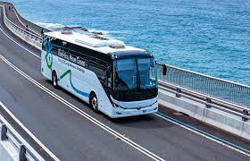
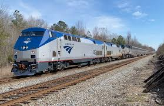
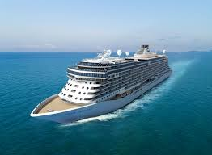

<!doctype html>
<html lang="en">

<head>
  <meta charset="UTF-8">
  <meta http-equiv="X-UA-Compatible" content="IE=edge">
  <meta name="viewport" content="width=device-width, initial-scale=1.0">
  <title>Transportation</title>
</head>

<body>

  <main>
    <h1>Transportation</h1>
    <h2>About</h2>

    

      
There are several types of transportation.

    

    

      <h2>Methods of Transportation</h2>

      
Depending on your destination, you may have many options to get you there. Below is a list of some of the most
        common types of transportation available today.

    

    

      <ul>
        <li>Car</li>
        <li>Bus</li>
        <li>Bicycle</li>
        <li>Train</li>
        <li>Airplane</li>
        <li>Boat</li>
        <li>Public</li>
      </ul>
    

    

      
Each type of <b>transportation</b> has its own advantages and disadvantages. I've ranked my favorites below.
      

      <ol>
        <li>Car</li>
        <li>Airplane</li>
        <li>Train</li>
        <li>Bus</li>
      </ol>

    

  </main>
  

    <h2>Gallery</h2>
    
    
    
    
    
    

  

  <a href="https://www.travelocity.com/">
    <h3>Travel Agency</h3>
  </a>

  <footer>
    
© 2023 Transportation

  </footer>

</body>

</html>
